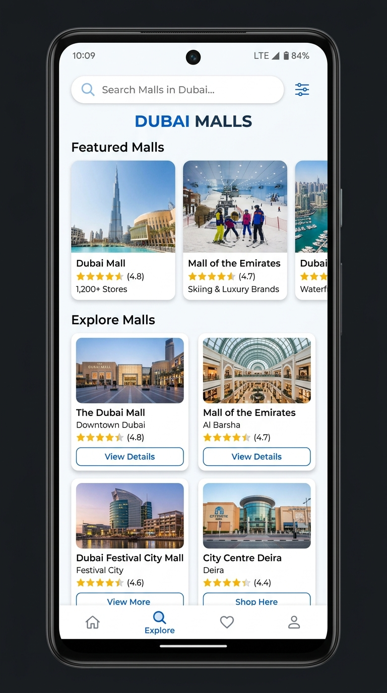
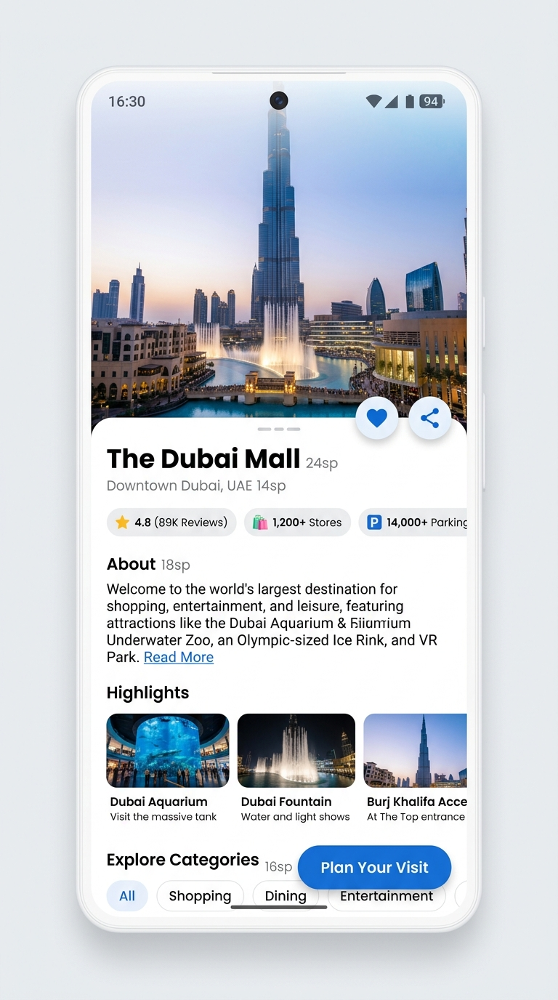

# Dubai Mall Maps

 

**Dubai Mall Maps** is a premium, beautifully crafted Android application designed to help users explore and navigate the most luxurious shopping destinations in Dubai. Built entirely with modern Android development practices and Jetpack Compose, the app boasts a stunning "Startup Blue" aesthetic and fluid, responsive UI across all device sizes.

## 🌟 Key Features

*   **Dynamic Mall Explorer**: Browse a curated list of top malls in Dubai featuring a clean, grid-based layout and horizontal featured carousels.
*   **Parallax Detail Screens**: Immerse yourself in gorgeous mall photography with fully responsive, scrollable bottom sheets.
*   **Trip Planner & Navigation**: Build custom itineraries and get one-tap routing using Google Maps. Transit mode integrations are built-in!
*   **Interactive Indoor Floor Plans**: Don't get lost inside! View pinch-to-zoom floor plans directly within the app.
*   **Cloud-Synced Configuration**: The app's data model is powered by a remote `config.json`, allowing instant updates to mall data without app store submissions.
*   **Favorites System**: Seamlessly save and track your most-loved shopping destinations.

## 🎨 Design & Aesthetic

Our UI is deliberately engineered to evoke a premium startup feel. We ditched the default Material You colors in favor of a strictly curated **Clean White & Deep Indigo/Startup Blue** palette (`#0052FF`, `#4338CA`, `#F9FAFB`). All typography, spacing, and micro-animations have been meticulously fine-tuned.

## 🛠️ Tech Stack & Architecture

*   **Language**: 100% Kotlin
*   **UI Toolkit**: Jetpack Compose (Material 3)
*   **Architecture**: MVVM (Model-View-ViewModel) + StateFlow
*   **Image Loading**: Coil
*   **Networking**: Retrofit2 + Gson (for remote config fetching)
*   **Data Persistence**: SharedPreferences (for Favorites & Trip Planner)
*   **Monetization**: Google AdMob (Native & Interstitial integrations)

## 🚀 Getting Started

### Prerequisites
*   Android Studio Ladybug (or newer)
*   JDK 17
*   Android SDK 36 (Minimum SDK 24)

### Building the Project
1. Clone the repository:
   ```bash
   git clone https://github.com/amrimarihotjati/dubai-mallmaps-antigravity.git
   ```
2. Open the project in Android Studio.
3. Sync Gradle and run on your emulator or physical device.

*Note: The app expects a valid `config.json` at the root of the repository to load its data dynamically.*

---
*Developed with precision by **Elzayn Dev**.*